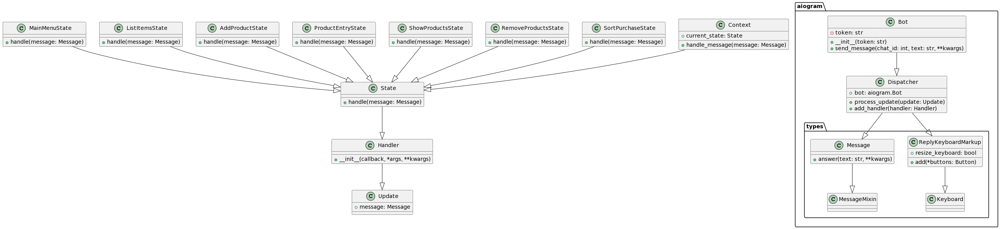

# Хоккейный бот для заполнения статистики

Хоккейный бот для заполнения статистики - это Telegram бот, разработанный для упрощения процесса заполнения статистики о хоккейных матчах.

## Инструкции по настройке

## Как запустить

1. **Установите Python версии 3.11+:** [Скачать Python](https://www.python.org/downloads/)

2. **Откройте командную строку или терминал:**
    - В Windows: Откройте командную строку в данной директории.
    - В Linux/macOS: Откройте терминал в данной директории.

3. **Создайте виртуальное окружение:**
    ```bash
    python -m venv venv
    ```

4. **Активируйте виртуальное окружение:**
    - В Windows:
        ```bash
        .\venv\Scripts\activate
        ```
    - В Linux/macOS:
        ```bash
        source venv/bin/activate
        ```

5. **Установите необходимые пакеты:**
    ```bash
    pip install --force-reinstall -v "aiogram==2.23.1"
    ```

6. **Запустите приложение:**
    ```bash
    python main.py
    ```


## Функции и использование

### Главное меню
- **Команды:** `/start`, `/help`
- **Действия:**
    - **Выбрать команду:** Начинает процесс выбора команды и добавления игроков.
    - **Добавить статистику:** Позволяет пользователю добавить статистику о матче.

### Выбор команды
#### Добавить игроков
- **Действия:**
    - **Выбрать позицию:** Пользователь выбирает позицию игрока и вводит его данные.
    - **Просмотреть всех игроков:** Отображает список всех сохраненных игроков.

### Добавление статистики
#### Добавить статистику о матче
- **Действия:**
    - Пользователь вводит статистику о матче (голы, ассисты и т. д.).
    - Статистика будет сохранена и доступна для просмотра.

### Просмотр статистики
#### Проконтролировать статистику
- **Действия:**
    - Отображает сохраненную статистику о матчах.

## Паттерн "Состояние"

В данном проекте использован паттерн проектирования "Состояние" (State), который предоставляет объекту возможность изменять свое поведение в зависимости от внутреннего состояния. Каждое состояние представлено отдельным классом, реализующим общий интерфейс, что обеспечивает единообразие взаимодействия между состояниями.

### Примеры использования паттерна "Состояние" в коде:

#### State (Состояние):

Класс `State` является абстрактным базовым классом для всех конкретных состояний. Он определяет общий интерфейс, через который осуществляется взаимодействие с объектом в различных состояниях.

```python
class State:
    def handle(self, message):
        pass
```
### Concrete States (Конкретные состояния):
Каждый конкретный класс состояния (например, MainMenuState, ListItemsState, AddProductState, и т. д.) наследуется от абстрактного класса State и реализует метод handle, который выполняет конкретные действия для данного состояния.

```python
class MainMenuState(State):
    async def handle(self, message):
        # ... (обработка главного меню)

class ListItemsState(State):
    async def handle(self, message):
        # ... ()

# Другие конкретные состояния аналогичны...
```
### Context (Контекст):
В контексте, представленном в вашем боте или его отдельной части, происходит управление переходами между состояниями.

```python
class AddPlayer(State):
    async def handle(self, message):
        # ... ()
        global current_state
        current_state = ProductEntryState()

```
### Transition between States (Переход между состояниями):
В различных обработчиках сообщений (например, при вводе названия продукта) происходит переключение состояний с использованием глобальной переменной current_state.

```python
class PlayerEntry(State):
    async def handle(self, message):
        # ... (обработка ввода)
        global current_state
        current_state = MainMenuState()
        await current_state.handle(message)
```

### Преимущества использования паттерна "Состояние":
Паттерн "Состояние" делает код более структурированным, облегчает добавление новых состояний и позволяет изменять поведение системы без изменения ее общей структуры. В результате код становится более поддерживаемым, гибким и расширяемым.


## UML - диаграмма
 

## Примечания

- Бот использует библиотеку `aiogram` для разработки Telegram бота.
- Состояния используются для управления различными состояниями бота, обеспечивая чистый и организованный рабочий процесс.
- Пользовательский ввод обрабатывается с помощью ряда команд и интерактивных меню.

## Не рекомендуется использовать паттерн "Одиночка" (Singleton)

### Почему не стоит использовать паттерн "Одиночка" (Singleton):

### 1. Недостаток гибкости:
   Паттерн "Одиночка" создает глобальный доступ к объекту и ограничивает возможность создания нескольких экземпляров класса. В данном проекте, вероятно, возможны ситуации, когда необходимо создать несколько экземпляров классов состояний для обработки различных сценариев или запросов от пользователей.

### 2. Сложность тестирования:
   Использование синглтона усложняет тестирование кода, так как объекты, зависящие от синглтона, могут вызывать проблемы при написании юнит-тестов из-за его глобального доступа.

### 3. Сложность внедрения зависимостей:
   Синглтон создает зависимость между классами, которые используют его. Это может затруднить внедрение зависимостей и усложнить архитектуру приложения.

### 4. Проблемы с многопоточностью:
   В случае многопоточного приложения необходимо учитывать особенности работы с синглтоном, чтобы избежать проблем с потокобезопасностью. Это может потребовать дополнительных усилий и усложнить код.

Вместо использования паттерна "Одиночка" рекомендуется использовать подходы внедрения зависимостей или создания объектов по мере необходимости. Это сделает код более гибким, улучшит его тестируемость и облегчит его поддержку в будущем.

